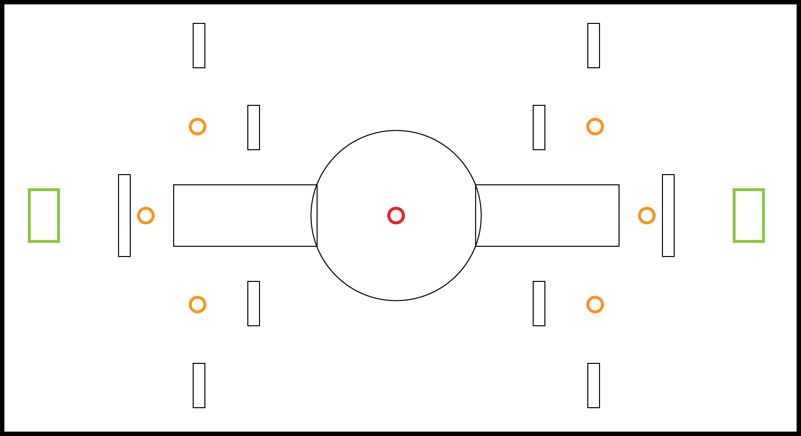

### Gameplay

Das grundlegende Gameplay, das wir bereits in der Spielbeschreibung für Aufgabe 1 festgelegt haben, änderten wir während Planung und Bau des Prototypen nicht. Es kann in der Spielbeschreibung unter dem Abschnitt "Gameplay" nachgelesen werden. Allerdings haben wir unsere Vorstellung davon, wie die Arena aussehen soll, mehrmals überdacht und mit Hilfe des Prototypen validiert. Letztendlich nahmen wir größere Änderungen am Map-Design vor, da wir beim Spielen des Prototypen feststellten, dass einige Ideen verworfen werden sollten und andere wiederum besser waren als zunächst angenommen.

##### Erster Entwurf:

Unseren ersten Prototypentwurf setzten wir nach dem Vorbild unserer Skizzen aus der Spielbeschreibung um.Im ersten Entwurf befand sich im Zentrum der Karte eine erhöhte Plattform, welche von zwei Seiten aus über Rampen erreichbar war und auf der sich das stärkste Power-Up befinden sollte. Die Objekte in der Arena, die zur Deckung dienen sollten (Wände, Kisten usw.) waren alle in die selbe Richtung ausgerichtet. Dies resultierte in wenig Vielfalt, was die Deckungsmöglichkeiten anging und erschien schnell zu langweilig.

##### Aktueller Entwurf:

Das momentane Design der Karte weist mehr Diversität auf und es wurden einige kleine Gameplay-Elemente hinzugefügt, um das Spielgeschehen zu vielfältigen und spannender zu gestalten.So befindet sich das stärkste Power-Up nun nicht mehr auf einer erhöhten Position, sondern wird auf Ground Level von zwei Gräben umgeben, in denen die Spieler/innen zusätzlich Deckung nehmen können, während sie um das Power-Up in der Mitte kämpfen. 

Außerdem wurden einige Deckungselemente (bspw. spiegelnde Wände) etwas gedreht positioniert,  sodass diese sinnvoller einsetzbar sind und zu spannenderen Spielsituationen führen können.

Des Weiteren wurden viele verschieden hohe Strukturen hinzugefügt, um durch den Einsatz des Jetpacks zusätzliche taktische Manöver zu ermöglichen. Die höchsten Strukturen sind die beiden Fahrstühle, die sich an zwei gegenüberliegenden Ecken der Arena befinden und in regelmäßigen Abständen hoch und herunter fahren. Dies gibt den Spieler/innen die Möglichkeit, sich einen Überblick über das Spielgeschehen zu verschaffen, wenn sie dafür ein wenig Risiko eingehen wollen. Denn obwohl die Plattformen der Fahrstühle eine gute Aussichtsplattform bieten, sind die zu allen Seiten offen und können den/die Spieler/in damit selbst zur Zielscheibe machen. 

Endlich im Prototyp umgesetzt sind auch die vier Löcher im Boden, welche zu einer (neu erdachten), unter der Map schwebenden Ebene führen. Diese kann dazu verwendet werden, um unter dem/der Gegner/in entlang  zu laufen und sie/ihn mit einem Hinterhalt zu überraschen. 

Mittig auf der Karte, kurz vor dem Zentrum mit dem Power-Up, stehen nun Plattformen, die von Säulen getragen werden. Sie sind rundherum offen, werden zum Zentrum jedoch von einer beweglichen Wand gedeckt. Diese Wand lässt sich in vordefinierter Richtung bewegen und dient als zusätzliche, dynamische Deckung vor einem Kampf in der Mitte der Arena.

### Erfahrungsbericht

Die Erstellung des Prototypen war sehr hilfreich, um unsere Spielidee zu konkretisieren und einige Gameplay-Aspekte zu verfeinern. Am meisten geholfen hat sie bei der Frage nach der Dimensionierung der Karte und dem Map-Design. Außerdem haben wir erkannt, dass eine zufällig generierte Karte, wie es ursprünglich geplant war, doch nicht so sinnvoll und gut umzusetzen ist, wie zuerst gedacht. Aus diesem Grund werden wir dieses Vorhaben nicht mehr weiter verfolgen.

Am Anfang haben wir viele verschiedene Kartengrößen ausprobiert und geschaut, wie diese in Relation zu unseren Spielobjekten und unserer geplanten Spielgeschwindigkeit aussieht. Dabei haben wir schnell gemerkt, dass es nicht so einfach ist, eine Kartengröße zu finden, welche nicht zu klein aber auch nicht zu überdimensioniert für zwei oder vier Spieler/innen ist. Nachdem wir uns letztendlich auf eine Größe geeinigt hatten, stellten wir durch Aufbau und Spielen fest, dass unser erster Kartenentwurf sehr langweilig und monoton war, also überlegten wir uns, wie wir das Gameplay verbessern könnten. 

Nach vier oder fünf Iterationen, bei denen einige neue Ideen kamen, und andere daraufhin wieder gingen, entschieden wir uns für die oben genannten Änderungen und spielten den Prototypen einige Male durch. Dieser hatte nun deutlich mehr Dynamik und Spielspaß als zu Anfang, vor allem nachdem wir die Position, Ausrichtung und Anzahl der Deckungsmöglichkeiten finalisiert hatten. Uns wurde klar, dass diese für ein faires und schnelles Spielgeschehen in einem Shooter unerlässlich sind. 

Letztendlich war die Erstellung des Prototypen schwieriger als gedacht, aber auch sehr sinnvoll für die Konkretisierung unserer Spielidee. Gerade Aufbau und Balancing der Arena konnten wir durch den Bau des Prototypen gut validieren und verbessern und wir sind froh, diese Erfahrung gemacht und unser Spiel bereits jetzt verbessert zu haben.

##### Einige Iterationen:

